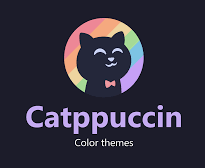

# Catppuccin Mocha — Hyprland Theme

Minimal Hyprland colour theme using the [Catppuccin Mocha](https://github.com/catppuccin/catppuccin) palette. Configures border colours, gap sizes and window rounding.

## What's included

```
.config/hypr/themes/catppuccin-mocha.conf   ← colour variables + general/decoration blocks
```

## Usage

After installing via RiceForge, add one line to your `~/.config/hypr/hyprland.conf`:

```
source = ~/.config/hypr/themes/catppuccin-mocha.conf
```

Then reload Hyprland (`Super + Shift + R`) — active window borders will switch to mauve/blue gradient.

## Preview


